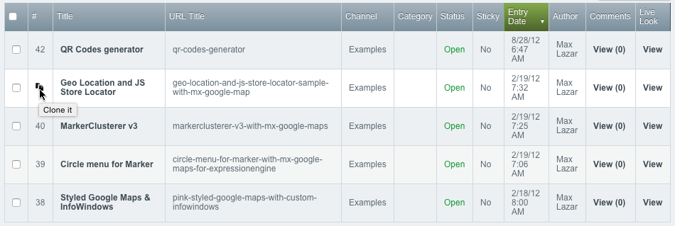

# MX CLONER #

This extension adds the ability to clone entries in CP.

* [Addon page on EEC.MS](http://www.eec.ms/add-ons/mx-cloner)

* [Addon page on Devot-ee](http://devot-ee.com/add-ons/mx-cloner)

##Compatibility
* Updater

##Installation
* Download the latest version of MX Cloner and extract the .zip to your desktop.
* Copy *system/expressionengine/third_party/mx_cloner* to *system/expressionengine/mx_cloner/*

##Activation
* Log into your control panel
* Enable MX Cloner extension & accessory 

##Field settings
**Title Field Suffix**	 Title prefix for new entry

**URL Title Suffix**	URL Title prefix for new entry

**Update Entry Time?**	

##Support Policy

This is Communite Edition (CE) add-on.

##Contributing To MX Cloner

Your participation to MX Cloner CE development is very welcome!

You may participate in the following ways:

* [Report issues](https://github.com/MaxLazar/mx-cloner/issues)
* Fix issues, develop features, write/polish documentation
Before you start, please adopt an existing issue (labelled with "ready for adoption") or start a new one to avoid duplicated efforts.
Please submit a merge request after you finish development.
* You can also be a **sponsor** of any additional features. Send me email - max @ eec.ms

###License

The MX Cloner is open-sourced software licensed under the [MIT license](http://opensource.org/licenses/MIT)

###Change log
####1.2.7 (release date: December 7, 2014)
* Expresso Store production field support (sponsored by [Karl Golts](www.linkedin.com/pub/karl-golts/6/940/aa4))
* Add Zenbu support; Thanks to [jaseclamp](http://devot-ee.com/profile/user21686489)
